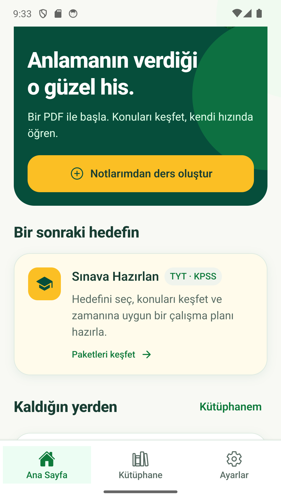
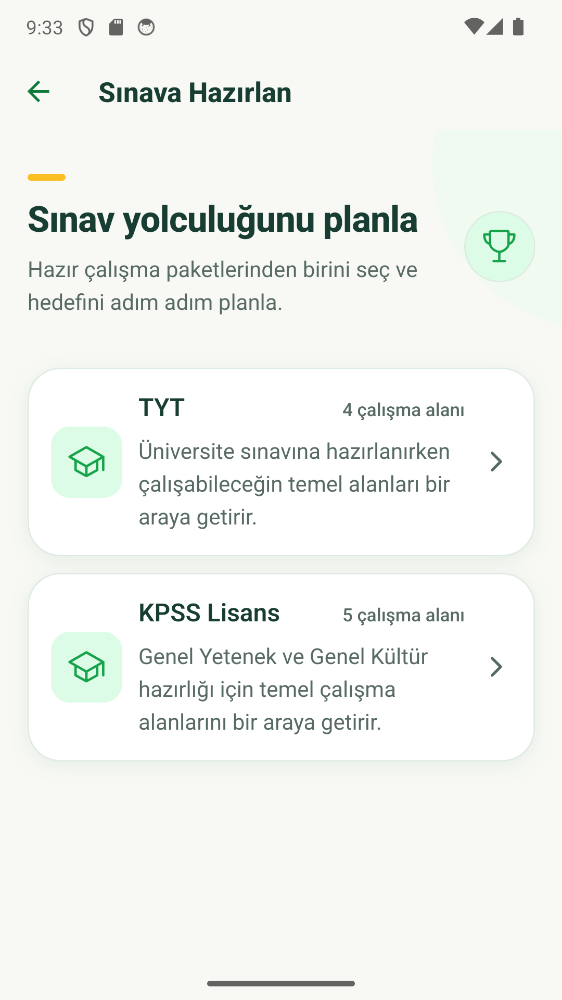
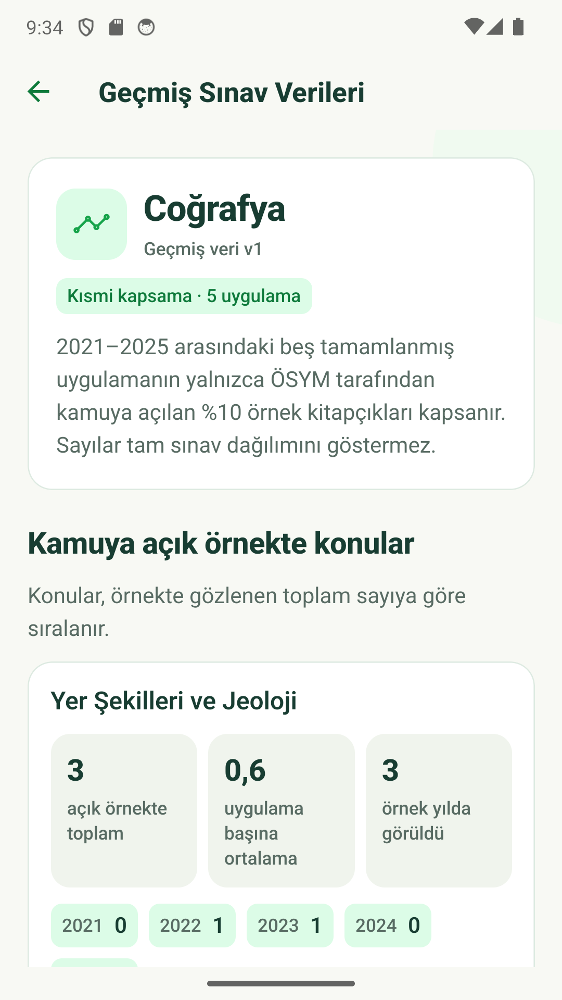
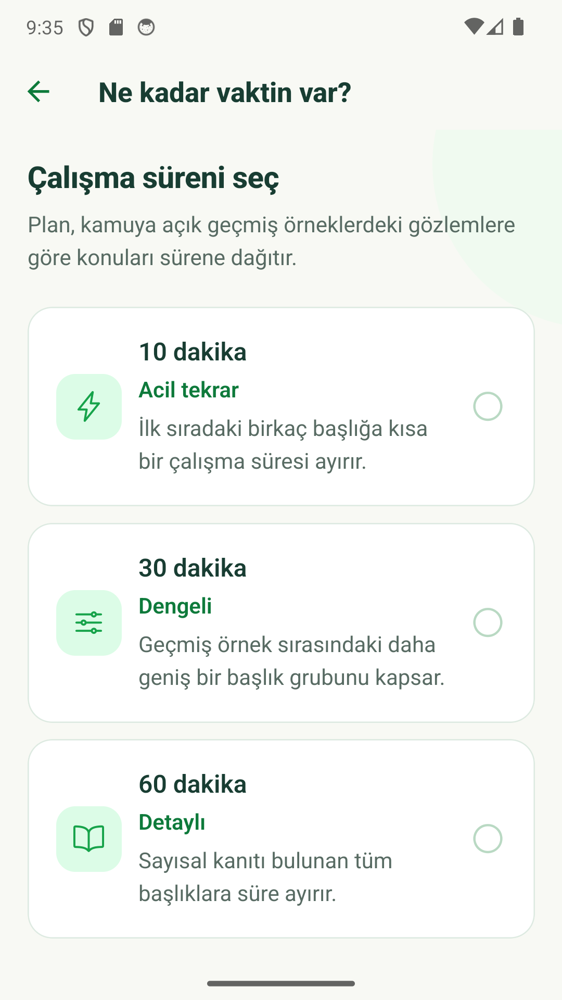
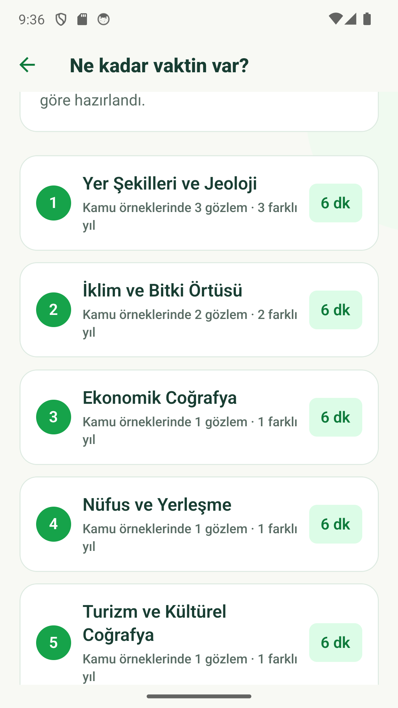
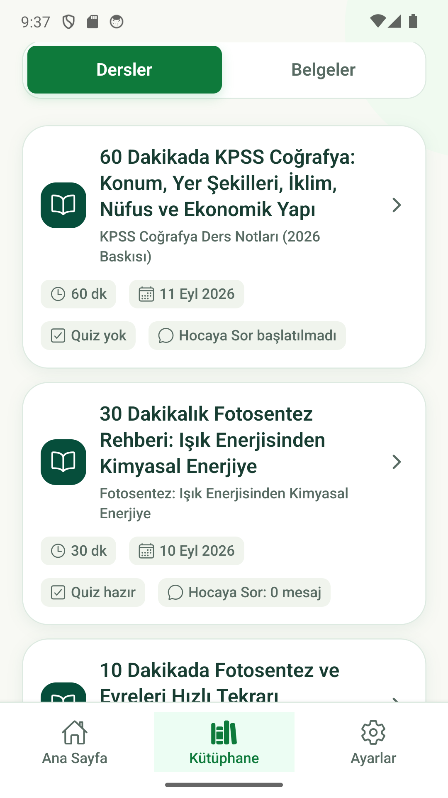
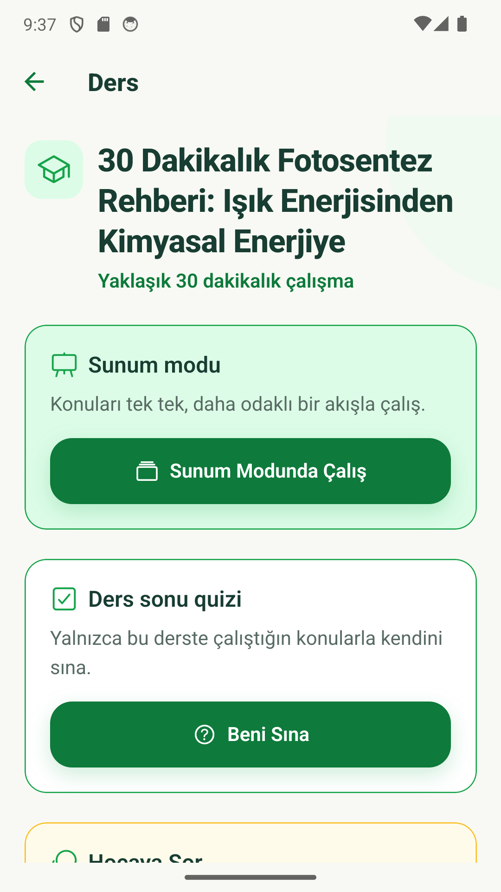
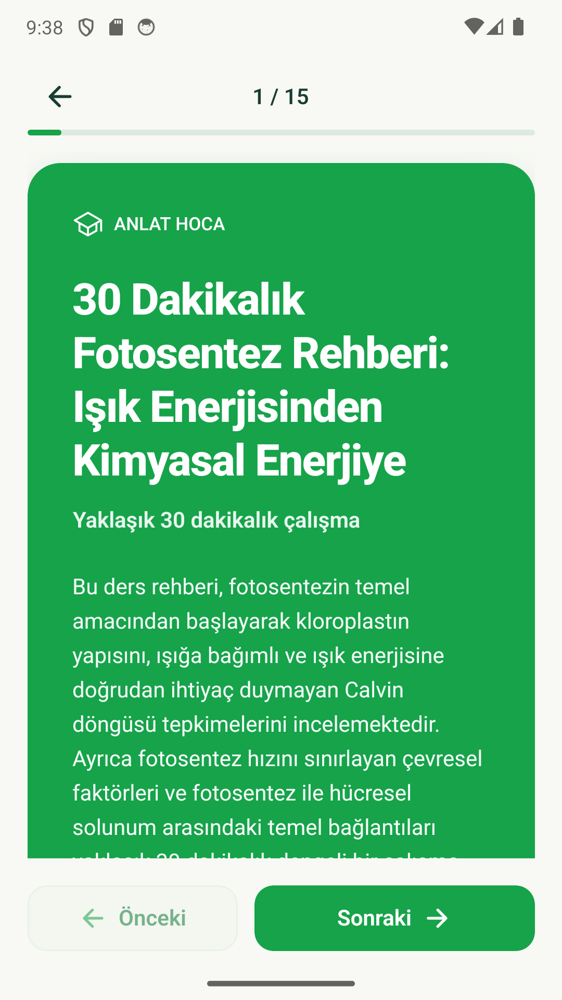

# Anlat Hoca

<p align="center">
  
</p>

<p align="center">
  PDF ders notlarını kişisel bir çalışma deneyimine dönüştüren mobil öğrenme asistanı.
</p>

Anlat Hoca V1, **Google Play yayın hazırlığı** aşamasındadır. Production mobil uygulaması Cloudflare üzerinde çalışan API'ye bağlanır.

Uygulama; PDF yükleme ve belge analizi, konu çıkarımı, 10/30/60 dakikalık dersler, sunum modu, ders kapsamlı quizler, **Hocaya Sor**, Kütüphane, KPSS geçmiş örnek gözlemleri ve kişisel çalışma planları sunar. Worker ve D1 backend'i Cloudflare production ortamında çalışır. Sesli anlatım/TTS, kullanıcı hesabı ve kalıcı ham PDF depolama V1 kapsamında değildir.

## Uygulamadan görüntüler

| Ana Sayfa | Sınava Hazırlan |
| --- | --- |
|  |  |
| **KPSS Coğrafya** | **Çalışma süresi seçimi** |
|  |  |
| **Kişisel çalışma planı** | **Kütüphane** |
|  |  |
| **Ders görünümü** | **Sunum modu** |
|  |  |

## Technology stack

- React Native and Expo SDK 57
- Expo DocumentPicker for local system PDF selection
- TypeScript and Expo Router
- Cloudflare Workers, Hono, and Cloudflare D1
- Zod schemas shared through `packages/contracts`
- pnpm workspaces
- Provider-based AI integration, with Gemini as the deployed V1 provider

## Repository structure

```text
apps/
  mobile/      Expo mobile application, document/lesson/quiz/teacher screens, API client, and bootstrap state
  api/         Worker API, Gemini providers, D1 migrations, learning services, and repositories
packages/
  contracts/   Shared runtime schemas and TypeScript API contracts
  prompts/     AI prompt ownership and conventions
  config/      Safe shared configuration and constants
docs/          Product, architecture, and development documentation
```

## Development setup

Prerequisites are Node.js 22.13 or newer and Corepack/pnpm. Install dependencies, apply local D1 migrations, and create the mobile environment file:

```powershell
corepack pnpm install
corepack pnpm db:migrate:local
Copy-Item apps/mobile/.env.example apps/mobile/.env
```

Replace `YOUR_COMPUTER_LAN_IP` with an address reachable from the device. `EXPO_PUBLIC_` values are bundled into the app and must never contain secrets.

Start the API and mobile app in separate terminals:

```powershell
corepack pnpm dev:api
corepack pnpm dev:mobile
```

## Common commands

```powershell
corepack pnpm db:migrate:local
corepack pnpm db:migrations:list:local
corepack pnpm db:migrations:list:remote
corepack pnpm db:migrate:remote
corepack pnpm deploy:api
corepack pnpm typecheck
corepack pnpm lint
corepack pnpm test
corepack pnpm --filter @anlat-hoca/mobile exec pnpm dlx expo-doctor@latest
corepack pnpm --filter @anlat-hoca/api generate-types
corepack pnpm --filter @anlat-hoca/api build
```

See [docs/development.md](docs/development.md) for local D1 inspection, device-specific API URLs, and detailed instructions.

## Current document pipeline

The mobile flow accepts one PDF of at most 15 MiB through the operating system picker and sends it as multipart form data to `POST /documents/upload`. The Worker independently validates the installation UUID, request shape, size, MIME type, and `%PDF-` signature before using the Gemini Files API resumable upload protocol.

The original PDF is temporarily stored by Gemini and is not stored in D1 or R2. D1 contains safe display metadata, internal temporary provider references, validated analysis output, and validated lesson artifacts. Public mobile responses contain no Gemini identifiers. Page counting is not implemented.

For local upload development, copy `apps/api/.dev.vars.example` to the ignored `apps/api/.dev.vars` and provide your own server-side `GEMINI_API_KEY`. Never place that key in the mobile environment.

Document analysis uses the server-only `GEMINI_ANALYSIS_MODEL` setting and defaults to `gemini-3.6-flash`. The first successful analysis is stored in D1 with its schema, prompt, and model version. Repeated analyze requests return that validated stored result rather than spending another model call.

The mobile results route reads only the cached D1 analysis. Opening the screen never triggers hidden analysis or regeneration.

## Current lesson pipeline

After analysis, the learner explicitly chooses a 10, 30, or 60 minute study budget. The Worker combines the persisted analysis with the still-available temporary Gemini PDF, requests structured Turkish teaching content, validates it with shared Zod schemas and duration tolerances, and persists the validated lesson in D1.

The cache identity includes document, duration, schema version, prompt version, and model. Repeating the same request returns the persisted lesson without another Gemini call. Opening `/lesson/[lessonId]` reads D1 only. A D1 generation claim limits rapid duplicate requests without adding paid coordination services.

## Current presentation mode

From the normal lesson screen, the learner can open `/lesson/[lessonId]/presentation`. The route retrieves the same persisted lesson through the existing D1-backed detail endpoint and deterministically projects it into focused intro, objectives, section, explanation, recap, and optional skipped-topic slides. Long explanations are split at paragraph, sentence, clause, and finally word boundaries without summarizing or dropping lesson text.

Presentation navigation supports native horizontal paging plus explicit previous/next controls, a textual slide index, and a progress bar. Presentation mode creates no AI request, backend artifact, or D1 row.

## Current quiz pipeline

The learner explicitly opens **Beni Sına** from a persisted lesson. The Worker supplies only that validated lesson to the independently configured `GEMINI_QUIZ_MODEL`, validates the structured Turkish multiple-choice output, assigns stable question IDs, and caches one current quiz per lesson/schema/prompt/model identity.

Ten, 30, and 60 minute lessons produce exactly 5, 8, and 10 questions. The initial mobile response contains questions and four options only; correct option indexes and explanations remain in the internal D1 quiz entity until submission. Submission makes no AI call: the Worker grades deterministically, persists a new immutable attempt, and aggregates incorrect answers by original lesson section.

From a persisted lesson, **Hocaya Sor** opens one installation-scoped conversation. Answers use only validated lesson content, retain up to six recent conversation turns, and explicitly decline questions unsupported by the lesson. Valid user/assistant pairs are persisted together; reopening history never calls Gemini. The Worker independently configures `GEMINI_TEACHER_MODEL`, validates structured answers and referenced lesson sections, and enforces a 30-question UTC-day installation limit.

## Current Library

`POST /library` reads a bounded, newest-first summary of the current installation's saved lessons and documents from D1. It contains only public display metadata such as document and analysis titles, lesson duration, latest quiz score when available, and teacher-thread/message counts. Library reads never call Gemini, create rows, or regenerate content.

Home requests at most three recent lessons. The Library tab requests at most 20 lessons and 20 documents, supports pull-to-refresh, and reopens existing lesson details or cached analyses. Uploaded but not yet analyzed documents open the explicit ready flow; selecting a Library item never starts analysis automatically.

## Current prepared exam pack foundation

GET /exam-packs and GET /exam-packs/:packId expose a small, versioned static catalog for TYT and KPSS Lisans. KPSS Lisans Tarih and Coğrafya additionally expose source-controlled historical insight data through GET /exam-packs/:packId/subjects/:subjectId/insights.

The insight dataset covers the official public 10% samples from the completed 2021–2025 administrations. It is explicitly partial, contains no question text or answer material, and never represents its observed counts as full-exam distributions or future probabilities. The mobile **Sınava Hazırlan** flow enables only these verified subjects and provides methodology plus direct ÖSYM source links. It can also turn the same verified ordering into a deterministic 10, 30, or 60 minute local study plan; shorter plans report omitted topics explicitly and remain observations rather than predictions. Static exam reads and study-plan creation use neither Gemini nor D1. See [the research note](docs/research/kpss-lisans-history-geography-v1.md).

## Privacy and release readiness

The Turkish V1 privacy policy is rendered from one shared source in the native `/settings/privacy` screen and at `GET /privacy` on the existing Worker. It truthfully describes anonymous installation scoping, voluntary PDF transfer to Google Gemini, Cloudflare D1 persistence, static exam insights, and installation-scoped user deletion. The internal [Google Play data safety worksheet](docs/release/google-play-data-safety.md) separates observed technical flows from Play Console classifications that the publisher must confirm in the live form. Release copy and human-owned checks are under `docs/release/`.
